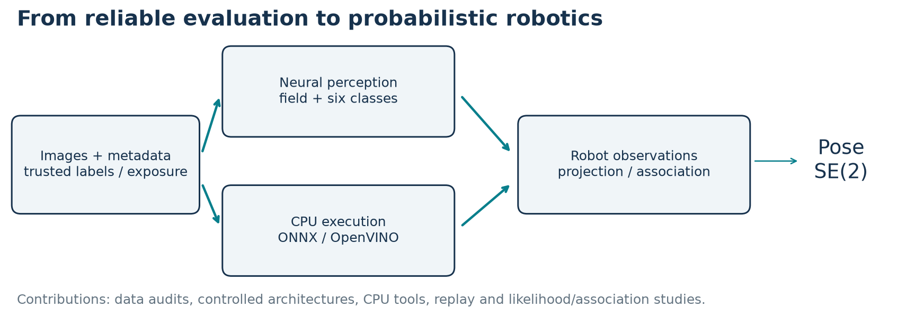
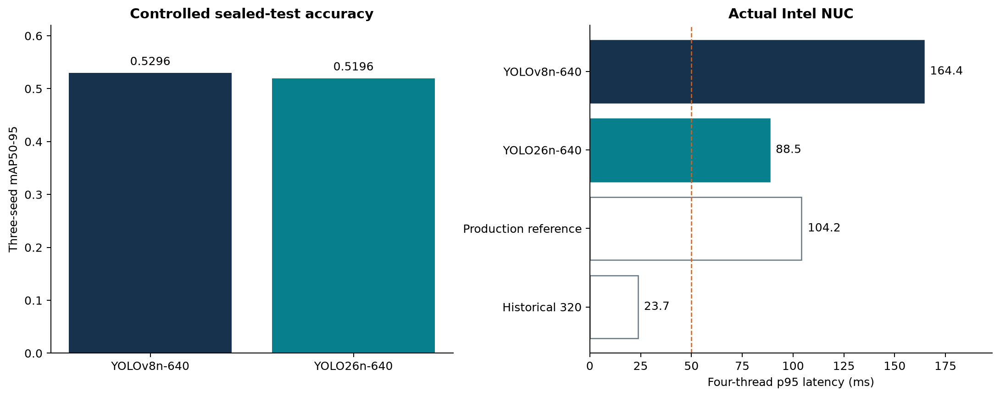
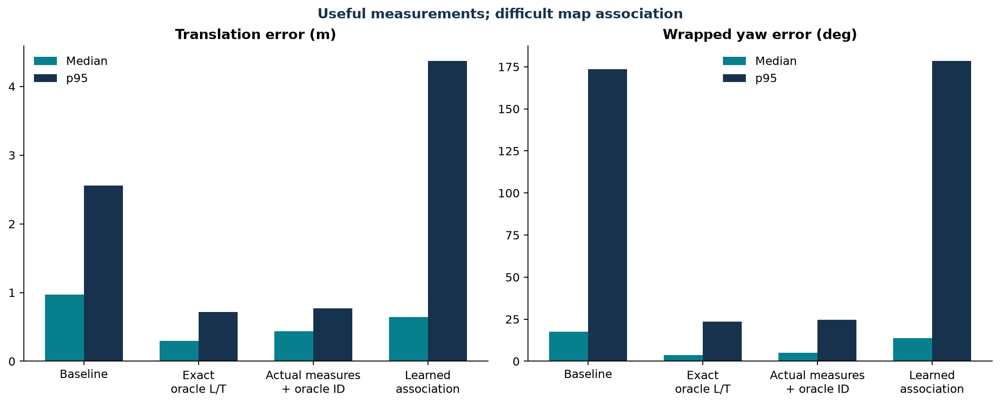

# RoboCup Humanoid Perception

**Vision, efficient inference and probabilistic localization**

A humanoid football robot must recognize a small moving ball, distinguish field
from clutter, and use repeated field markings to estimate its position. It must
do this while its camera moves and its onboard CPU also runs the rest of the
robot. This project investigates the complete chain from trustworthy labels to
neural perception, CPU inference and pose-level validation.

I am **Yacine Zahouani**, an ENSEIRB-MATMECA engineering student. I developed this
research programme with **ITA-ITAndroids**, supervised by **Marcos Maximo**. My
contributions include annotation correction and evaluation design, controlled
model studies, selective-sharing architectures, deployment tools, deterministic
simulation, probabilistic localization experiments and a focused C++ correction.
The robot, team software and established model families are upstream work.

[Technical reports](docs/reports/index.md) ·
[Source map](#source-map) ·
[Model contracts](docs/model-cards/README.md) ·
[Engineering handoff](docs/handoff/README.md) ·
[Releases](https://github.com/yacinezah/robocup-humanoid-perception/releases)



## Selected results

| Contribution | Result | Evidence |
|---|---|---|
| Trustworthy field/line supervision | Corrected line labels, sequence grouping and deterministic evaluation; explicit-line Dice **0.8488** | Corrected final-only real-image evaluation |
| Controlled six-class detection | **12,018 images, three seeds**; YOLOv8n mAP50-95 **0.5296**, YOLO26n **0.5196** | Same-data sealed test |
| Actual target-CPU measurement | YOLO26 had **46% lower four-thread p95** latency than YOLOv8; Fast-SCNN field inference **13.079 ms p95** | Intel NUC, measured separately by study |
| Selective sharing with private field context | Selected efficient-sharing Dice **0.9902**, versus separate specialist **0.9893**; detector preserved | Matched open development evidence |
| Typed-landmark causal localization | Real detector measurements with oracle map identity recovered **79.5%** of oracle median-translation gain | Gazebo diagnostic, not a deployable identity source |
| Probabilistic software debugging | Corrected neutral likelihood gating that let incompatible hypotheses outrank compatible ones | C++ tests, Gazebo and real-Chape runtime regression |

Accuracy and latency are not one universal leaderboard. The 640-pixel detectors
remain too slow for a 50 ms NUC p95 target. Multitask field quality is close to
specialists on selected development data, but seed sensitivity, modest laptop
CPU gains and strict raw-parity limits remain. Real robot localization accuracy
was not measured. The deployed perception stack was not replaced.

## Research contributions

### Reliable evaluation before model selection

Manual mask correction and trusted supervision made line/field evaluation
meaningful. Sequence and duplicate audits found **54 and 66 overlapping groups
in two different historical splits**. Deterministic preprocessing, exposure
ledgers and frozen protocols replaced misleading comparisons.

### Neural architecture and CPU tradeoffs

Separate field specialists establish quality and speed references. A controlled
YOLOv8n/YOLO26n study separates architecture effects from data and seed effects.
The multitask investigation progresses from supervision scale to a private
field-semantic hierarchy, with frozen-sharing, joint-training and distillation
controls. It distinguishes gains from field capacity from gains due to shared
representation learning.



### Perception tested through robot behavior

A deterministic **16-scenario, 2,250-frame ROS/Gazebo benchmark** exposes geometry
and temporal behavior. Field-context ball reranking improved designed stress
cases but regressed on untouched replay, so it was not promoted. Localization
experiments separate landmark utility, measurement noise, map identity and
likelihood semantics. Later sensor/line studies improve typical tracking while
exposing tail errors, map consistency and symmetric-field ambiguity.



## Try it

### Dataset-free CPU checks

```bash
python -m venv .venv
# Activate the environment for your shell, then:
python -m pip install -e ".[test,runtime]"
python -m pytest
python examples/synthetic_smoke.py
```

The smoke example uses artificial geometry and observations. It does not train,
download weights, contact a robot or access private evaluation images. Neural
unit tests additionally require the versions listed in the environment guide.

### Inference on your own image

Explicitly obtain a **raw-head multitask** model bundle from Releases, verify its
checksums, and follow its model card. Then:

```bash
perception-infer --model artifacts/multitask.xml --image my-frame.jpg \
  --thresholds artifacts/thresholds.json --output prediction.json
```

This writes source-coordinate detections and a field-probability array. It does
not reject balls, track objects or associate landmarks with a map. Native
end-to-end YOLO26 exports need their own decoder and must not be passed to an
incompatible raw-head contract.

For a new CPU measurement, `perception-benchmark --help` exposes explicit
thread, stream and power-state settings. Its synthetic-input model-only timing
is not a reproduction of historical complete-call timings.

## Source map

| Area | Implementation | Start here |
|---|---|---|
| Data and metrics | [Exposure grouping, bootstrap and metrics](src/robocup_perception/data/) | [Evaluation rules](docs/methods/data-and-evaluation.md) |
| Segmentation | [Inherited MIT model/training code](src/soccer_segmentation/) | [Field/line study](docs/reports/three-class-field-and-line-segmentation.md) |
| Detection | [Raw-head decoding](src/robocup_perception/detection/) | [Controlled comparison](docs/reports/controlled-yolov8n-yolo26n-comparison.md) |
| Multitask | [Models, losses, data masking and trainers](src/robocup_perception/multitask/) | [Architecture and contract](docs/methods/multitask-contract.md) |
| CPU inference | [ONNX/OpenVINO export, parity and timing](src/robocup_perception/runtime/) | [Reproducibility](docs/reproducibility.md) |
| Ball selection | [Field-contact features and scoring](src/robocup_perception/ball_selection/) | [Generalization result](docs/reports/field-context-ball-selection.md) |
| ROS/Gazebo | [Scenarios, capture, replay and patches](simulation/) | [Simulation dependencies](simulation/README.md) |
| Localization | [Association, sensor assumptions and lines](src/robocup_perception/localization/) | [Observability audit](docs/reports/map-observability-and-symmetry.md) |
| C++ repair | [Exact patch and component test](patches/observation-likelihood/) | [Review and rollback](docs/handoff/localizer-review.md) |

## Reports and reproducibility

[Sixteen technical reports](docs/reports/index.md) contain methods, authoritative
tables, qualifications and implementation links. They are authored project
reports, not peer-reviewed publications. The [ENSEIRB reference map](reproducibility/enseirb-references.json)
links references [6]-[21] to stable professional documents. Frozen results have
not been re-evaluated for publication.

The [reproducibility guide](docs/reproducibility.md) distinguishes public smoke
tests, user-image inference and scientific reproduction requiring separately
licensed data. Git contains source, synthetic tests, small aggregate tables and
figures. Releases contain selected artifacts and manifests. Datasets, protected
frame identities, raw captures and optimizer states are excluded.

## Handoff and next steps

The [handoff guide](docs/handoff/README.md) separates research prototypes from
reviewable software. The C++ likelihood patch is isolated from experimental
association. Neither the patch nor a new neural stack is represented as merged
into production.

The next integration decisions require an independent real-robot accuracy/pose
corpus, an agreed end-to-end timing budget and robust association under field
symmetry. The present repository provides the code and evidence needed to make
those decisions without repeating invalid comparisons.

## Citation, licence and acknowledgements

Use [CITATION.cff](CITATION.cff) and the immutable release commit when citing this
edition. Original utilities use MIT, original reports/figures/tables CC BY 4.0,
and inherited components retain their own terms. See [LICENSE](LICENSE) and
[third-party notices](THIRD_PARTY_NOTICES.md), especially for Ultralytics-derived
code and model obligations.

Thanks to Marcos Maximo and ITAndroids for supervision, robot infrastructure and
collaboration, and to the maintainers of the open-source frameworks used here.
